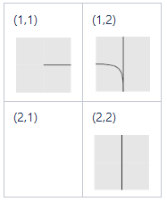
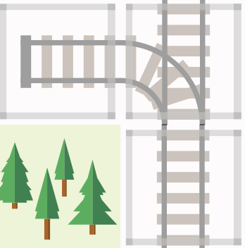

# Real Time Large Network Re-Scheduling
## Problem and Industry State of the Art

Switzerland has a dense railway network with both freight and passenger trains running on the same infrastructure.
More than 1.2 million people use trains on a daily basis.
In Railway Operations, the operational schedule has to be continually re-computed because of many smaller and larger delays that arise during operations.
Not all of those can be absorbed by extra times in the schedule, and if the delay has an impact on other trains, decisions on re-ordering or re-routing trains have to be taken to derive a new feasible operational plan.
The industry state of the art is that delay propagation is efficiently re-computed by onlyine IT systems
Conflicts, however, have to be most often resolved by humans by explicitly deciding on re-ordering or re-routing based on their experience.
Because of the massive combinatiorial complexity of these microscopic models, Operations Research models are currently only applied in very restricted, highly condensed areas for re-ordering decisions but do not consider routing alternatives.

## Research Approach
To tackle this problem, our approach is to combine Operations Research and Machine Learning to get the best of both worlds:
a Graph Neural Network acts as an Oracle for Operations Research by learning a heuristic that predicts the "impact" of a delay;
we hope the Oracle could predict which trains and which departures are or could be affected by the delay based on past decisions.
This piece of information from the oracle then helps the (MILP or CP) solver to constrain the search space  or at least drive its search more efficiently (driving the branching process).
We hope that Graph Neural Networks are a natural way to represent the graph structure of railway networks.

## Research Plan

* Hypothesis 1: We can compute good recourse actions, i.e., an adapted plan within the time budget,
              if all the variables are fixed, except those related to services that are affected
              by the disruptions implicitly or explicitly.
* Hypothesis 2: Machine learning can predict services that are affected by disruptions implicitly or explicitly.
* Hypothesis 3: If hypothesis 2 is true, in addition, machine learning can predict the state of the system in
              the next time period after re-scheduling.

## Pipeline for Verification of Hypothesis 1
### Input generation

| Step                           |
| ------------------------------ |
| Generate infrastructure        |
| Generate schedule              |
| Generate disturbance           |
| Full Schedule (w/o disturbance)|

### Hypothesis Validation
How big is the speed up if we know Delta?

| Step                                  |
| ------------------------------------- |
| Re-Scheduling full w/o restrictions   |
| Determine Delta w.r. to Full Schedule |
| Re-Scheduling Delta                   |


## Scheduling and Re-Scheduling on FLATland problem with Google OR Tools or ASP
The following sections describe how solve a FLATland problem with 
- Google ortools CP-SAT solver
- ASP 
- Google ortools MIP solver (fortcoming)


## Quick Start
You need to have installed `conda`. Then,
```shell
python -m pip install tox tox-conda
# alternatively: conda install tox tox-conda
python -m tox .
```
This runs the unit tests in the Python virtual environment provided by the tox manager.

In order to run the experiments,
```shell
conda create -n rsp python=3.7
conda activate rsp

# install requirements
conda install -c potassco clingo-dl=1.1.0

# caveat: under Windows, the FLATland installation may fail, refer to http://flatland-rl-docs.s3-website.eu-central-1.amazonaws.com/01_readme.html#installation)
python -m pip install -r requirements.txt

# install rsp in virtual env (do this  after every code modification)
python setup.py install

# run pipeline
python rsp/hypothesis_one_experiments.py
```


## Architecture Overview Scheduling
We implement the following pipeline:
```text
FLATland environment --> ProblemDescription --> SolutionDescription --> ActionPlan --> FLATland environment
```
The interpretation is the following:
- A FLATland `RailEnv` with agents and their schedule is taken as input.
- Then, a `ProblemDescription` is created from it, i.e. the FLATland problem is transformed to one of the models described below.
- When the problem is solved, the result is captured in a `SolutionDescription`.
- The `SolutionDescription` provides an `ActionPlan` which describes the actions that can be replayed in the FLATland environment. Thereby, the solution can be verified.

Notice that we do not convert `RailEnv` into a solver-independent representation of this generic model.
We have `AbstractProblemDescription` and `AbstractSoluctionDescription` that the define the interface the solver specific
sub-classes need to provide:


## Business Rules `ProblemDescription`
The `ProblemDescription` transforms a FLATland `RailEnv` to a Railway Scheduling problem, as detailled in:
* [Business Rules Train Schedule Optimisation Challenge](https://github.com/crowdAI/train-schedule-optimisation-challenge-starter-kit/blob/master/documentation/business_rules.md)
* [Input Data Model](https://github.com/crowdAI/train-schedule-optimisation-challenge-starter-kit/blob/master/documentation/input_data_model.md)
* [Mathematical Model Train Scheduling](https://www.cs.uni-potsdam.de/wv/publications/DBLP_conf/lpnmr/AbelsJOSTW19.pdf)
The problem described here is slightly more general, we do not use all features of this model yet as detailled in the following table:

| [Business Rule](https://github.com/crowdAI/train-schedule-optimisation-challenge-starter-kit/blob/master/documentation/business_rules.md) | Business Rule Description       | Method to implement when subclassing `AbstractProblemDescription` | conversion            |
|-----|---------------------------------------------------|------------------------------|-----------------------|
|   2 | each train is scheduled                           | `_implement_train`           |                       | 
|   5 | train_run_sections form a path in the route graph | `_implement_route_section`   | currently only one shortest path per train |
| 101 | Time windows for latest-requirements		      | `_implement_agent_latest`    | only global time window (0,maxsteps), <br/> no schedule in Flatland yet |
| 102 | Time windows for earliest-requirements	          | `_implement_agent_earliest`  | only global time window (0,maxsteps)	               |
| 103 | Minimum section time                              | `_implement_route_section`   |	derived from speed   |
| 104 | Resource Occupations		                      | `_implement_route_section` (ASP) <br/> `_implement_resource_mutual_exclusion` (ortools) |one resource per edge, <br/>many edges may map to the same resource (=grid cell), <br/> release time globally 1 |
| 105 | Connections	                                      | -                            | no connections in FLATland yet|

### Details of the conversion FLATland -->  `AbstractProblemDescription`

Consider the following partial FLATland grid:


&nbsp;&nbsp;&nbsp;&nbsp;or&nbsp;&nbsp;&nbsp;&nbsp;


For each train, a graph is constructed in the following way:
- We choose the paths that the agent is allowed to travel (for the time being, it's only one shortest path per agent)
- Along these paths, we associate an entry event into the cell for each direction the agent can enter the cell along these paths, i.e. the vertex `<train 1>_(2,2)_N` means "event that train 1 enters cell (2,2) facing north".

For the partial grid above, this construction results in the following partial directed graph:
- the agent can move facing north into (2,2) by (2,2)_N, transit to (1,2) through (1,2)_N and go further north exiting through (0,2)_N
- the agent can move facing south into (1,2) by (1,2)_S, transit to (2,2) through (2,2)_S and go further south exiting through (2,3)_S
- the agent can 
  - move facing north into (2,2) by (2,2)_N, 
  - transit to (1,2) through (1,2)_N, 
  - turn left into (1,1) through (1,1)_W, 
  - turn around back to (1,2) through (1,2)_E, 
  - exit (1,2) through (2,2)_S
  - go south exiting (2,2) through (2,3)_S


(In the notation in the diagram, the reference to the train has been omitted for readability.)

Here, the switch at cell (1,2) maps to four directed edges, one for each movement.
For the train to use one of these 4 routing possibilities, it is required to acquire exclusively the cell (1,2), i.e.
each cell is mapped to resource, which is the same for all trains and all edges over this cell!

The vertex identifier consists of ```<train, cell row, cell column, entering direction>```

The minimum running time in an edge is the inverse of the agent's seed in **FLAT**land.

**Restriction 1**
In the case of only one routing path, we associate exactly one event with each vertex.
Therefore, we do not consider solutions to the **FLAT**land problem that would require passing through more than one time
entering in the same direction. We do not know whether this restricts our OR approach from finding optimal solutions in **FLAT**land.

In the above example, the train can go from (2,1) to (1,2), to (1,1) to (1,2) to (2,2) since every time the direction is different!

**Restriction 2**
The **FLAT**land environment works in discrete time steps. At every time step, an agent can perform an action.
However, the action taken are applied sequentially over the agents a0,...,an. 
Consider the following scenario: at some time step, agent a_i and a_j (i<j) could enter the same cell; 
we could produce a non-solution in **FLAT**land by allowing agent a_j to enter the cell.
By imposing for all resources a release time of 1, we force agents a_i and a_j to stay in the previous cell; 
by forcing a_i to stop and let a_j enter at the next time step, we only produce solutions that are feasible/replayable in **FLAT**land.

This may restrict our OR approach from finding the optimal solutions in **FLAT**land.
If we only need **FLAT**land as a scenario generator and do not need the solution to be feasible/replayable in **FLAT**land, we could allow for release times to be zero.
 
**Caveat entering and exiting**
When an agent enters **FLAT**land (the cell is free), it has to wait for one time step before it can start to move. 
Therefore, we apply a waiting time of 1 to the initial edges.

**Restriction 3**
When a train reaches its destination (or one of its destination in the case of routing alterntives), it is immediately removed from **FLAT**land.
In order to prevent the sequencing problems as in Restriction 2, we require the train to  


### `ORToolsProblemDescription`
It assumes that the FLATland problem can be solved by using shortes path walks only. That means for each agents the 
system has only to decide whether it can make one step along agent's shortes path or not. If the problem can be 
solved under this assumption the problem is a simple ordering-problem. No alternative paths are required. 
Furthermore, it does not support multiple speeds yet.

### `ASPProblemDescription`
The `ASPProblemDescription` uses the ASP encoding from:
* https://github.com/potassco/train-scheduling-with-clingo-dl/blob/master/encodings/encoding.lp
* https://www.cs.uni-potsdam.de/wv/publications/DBLP_conf/lpnmr/AbelsJOSTW19.pdf
* https://www.cs.uni-potsdam.de/~torsten/hybris.pdf
Notice that all features of the generic scheduling model could be implemented in this encoding such as 
* multiple paths
* multiple resources per edge
* several routing alternatives per train
* time windows per section

#### ASP heuristics
* routes heuristic: edges are penalized by the index of their first occurence in the list of the k shortest paths (currently activated)
* sequence heuristic: does not apply here since our vertices all have the same time window
* delay heuristic: not implemented yet

#### ASP additional constraints
* bound_all_events.lp: upper bound on all times at vertices

#### ASP optimization objectives
In ASP with Difference Logic (DL), there is no direct minimization station for `&diff`, `&sum` etc. but we have to emulate such a statemtent by programmtic means (a multi-shot loop has to be written explicitly).

Available objectives
* multi-shot+bound_all_events.lp : optimize the makespan (the latest arrival of all trains) 
* minimize_routes: we penalize not using the optimal path (this is not currently activated, since being the only objective, it would keep agents on the shortest path, but total costs would 
* minimize_total_sum_of_running_times.lp: minimize the sum of all running times 
* minimize_delay.lp: in re-scheduling, minimize the total delay at the target node with respect to the schedule (not implemented yet)


### ASP current settings for hypothesis 1
* scheduling: 
** currently: minimize_total_sum_of_running_times.lp, bound_all_events.lp (`env._max_episode_steps`)
* re-scheduling: 
** currently: not implemented yet (TODO SIM-137)
** goal: minimize_delay.lp


### Brief overview of the implemented MIP formulation 
Example of a mixed-integer programming (MIP) with Google OR-Tools can be found following the 
[link to the how-to](https://developers.google.com/optimization/mip/integer_opt#declare-the-solver).


[Rule 101](https://github.com/crowdAI/train-schedule-optimisation-challenge-starter-kit/blob/master/documentation/business_rules.md) Time windows for latest-requirements: ``_implement_agent_latest``


[Rule 102](https://github.com/crowdAI/train-schedule-optimisation-challenge-starter-kit/blob/master/documentation/business_rules.md) Time windows for earliest-requirements: ``_implement_agent_earliest`` 


[Rule 103](https://github.com/crowdAI/train-schedule-optimisation-challenge-starter-kit/blob/master/documentation/business_rules.md) Minimum section time: ``_implement_route_section``

FLATland supports multi-speed such that each agent can have it's own speed (``agent.speed_data['speed']``). The 
```ProblemDescription``` sets the ```minimal travel time=np.ceil(1/speed)```.


[Rule 104](https://github.com/crowdAI/train-schedule-optimisation-challenge-starter-kit/blob/master/documentation/business_rules.md) Resource Occupations: ``_implement_resource_mutual_exclusion``

One time step is required because FLATland updates all agents at same time step. 

The variables ``V a < b`` controls the ordering of  ``Agent a`` and   ``Agent b`` at resource ``Rx``.  
If the ``V a < b`` is set to ``1`` then ``Agent a`` allocates resource ``Rx``  before ``Agent b``. 

The variables ``V b < a`` controls as well the ordering of  ``Agent a`` and   ``Agent b`` at resource ``Rx``.  
If the ``V b < a`` is set to ``1`` then ``Agent b`` allocates resource ``Rx``  before ``Agent a``. 

As the sum of ``V a < b`` and ``V b < a`` must be equal to ``1`` and as both variable only can hold ``0`` or ``1`` so 
only ``V  a < b`` or ``V b < a`` can be set to ``1``. 
This result in that only one of the first two equation will be used. So variables ``V...`` is a switching variable. 
``V...`` can enable/disable one equation. The constant valued variable ``S`` is used to make one equation 
fully satisfied without taking in account the other terms.  

Special case: If agents don't have speed = 1.0 which means the minimal travel time for one resource is longer than one 
simulation step. Otherwise one agent tries to enter the conflicting resource to early and this leads into a synchronisation 
issue where the solution is no longer a FLATland solution.    


##### Only one scenario can not be solved without alternative paths
The scenario/level ```./Envs/Test_9/Level_92.pkl``` cannot be solved without using alternative to shortest path. The 
solver 
answers 
with 
```No solution exists. MPSolverInterface::result_status_ = MPSOLVER_INFEASIBLE``` solution found. 

##### Number of Agents vs. Calculation Time in ORTools
The scaling of the x-axis (calculation time) is chosen logarithmically. The y-axis shows the number of agents. 
The poor scaling behavior of the current ```MIPSolver``` can be get out of the chart. (The number of agents determine 
the expected calculation time very well by using the formula ```calc_time ~ x ** num_agents```) or in words 
exponential increase. 


The whole program can be found in ````solve_test.py````

# ffmpeg
```
sudo apt install ffmpeg
cd rsp/rendering_output
ffmpeg -r 5 -s 1920x1080 -i flatland_frame_0000_%04d_ASP_10.png  -vcodec libx264 -crf 15 -pix_fmt yuv420p out.mp4

``` 

# Disclaimer
## Authors: 
- Adrian Egli
- Christian Eichenberger 
- Erik Nygren

## Diagram Source
Most of the diagrams are drawn using the draw.io plugin in confluence: [confluence.sbb.ch](https://confluence.sbb.ch/x/aIfBU)

